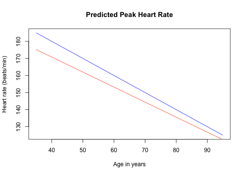
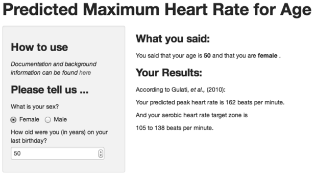

## What is the problem?

1. To achieve an aerobic workout, it is usually recommended to exercise in
order to achieve a heart rate in the target zone of 65--85% of your predicted
peak heart rate for your age.
2. The formula for maximum heart rate,  220-age, was developed using
cohorts of men.
3. Because this formula may not apply to women, standard advice on exercise
programs from such places as the
[Mayo Clinic](http://www.mayoclinic.org/healthy-living/fitness/in-depth/exercise-intensity/art-20046887?pg=2)
and the [Cleveland Clinic](http://my.clevelandclinic.org/heart/prevention/exercise/pulse-target-heart-rate.aspx)
may not be appropriate for women's exercise programs.

--- .class #id 

## Is there really a difference between men and women

* With respect to exercise capacity (and many other things!), the answer is *yes*.
* Dr. Martha Gulati and colleagues studied 5932 women to determine their
maximum heart rate on a treadmill.
* The fitted regression line for these data was used to produce a formula
for predicted heart rate in women.

---

## How much difference does it make?

The figure shows the difference between
the regression line for men (blue)
and the regression line
for women (orange).  At every age, the predicted peak heart rate
for men overstates the figure for women.  At age 50, it is about
5 percent too big.

 

---

## A Shiny app can help!
* Use the _Peak Heart Rate Calculator_, at https://rthisted.shinyapps.io/PeakHeartRate/
* You enter your sex and age, and the calculator uses the right formula to calculate
  + The correct predicted peak heart rate, and your target aerobic heart-rate zone
  + Example:
  

